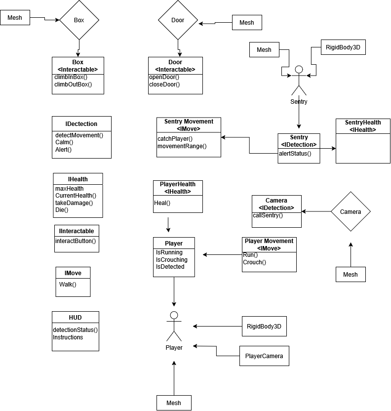

# Architecture

We will be employing an Interface-based architecture for our stealth title. We believe this will be the most applicable, as this would allow us to make many of the base systems modular. For example, the enemy detection code could easily be turned into an IDetection interface, which could then be used on both the cameras and enemies. This architecture would be more useful for our situation than a component-based format, as it will be less resource intensive having enemy prefabs accessing a unified interface, rather than an attached Detection script independently running on each enemy instance. Additionally, if we were to implement a player or enemy health system, interfaces would be far better suited to implementing this system.

